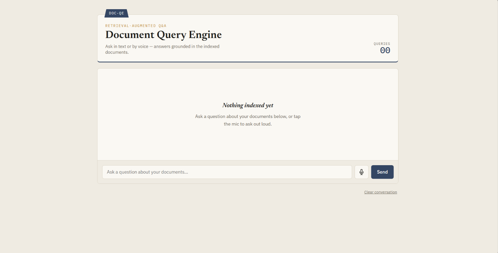
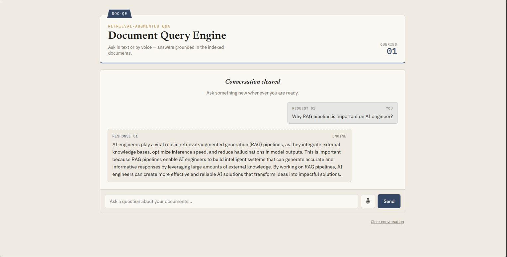
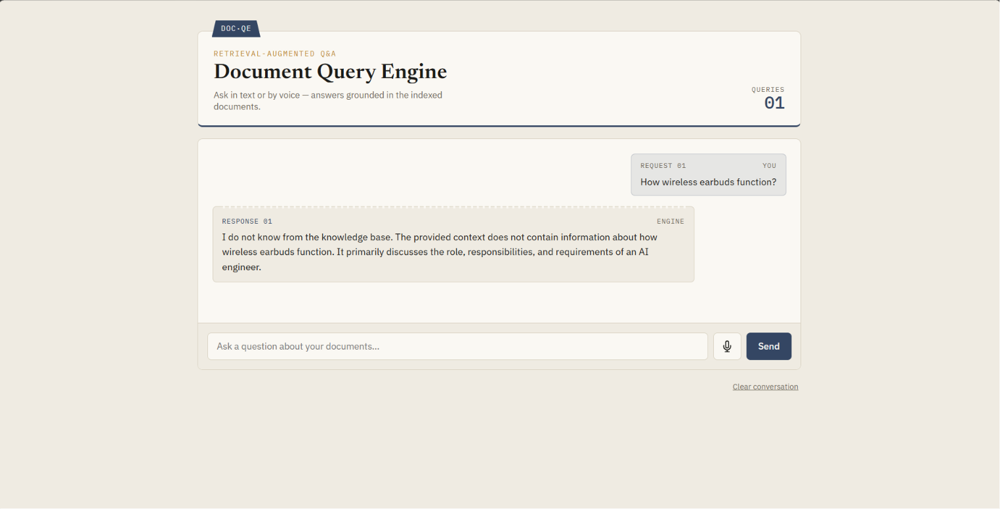
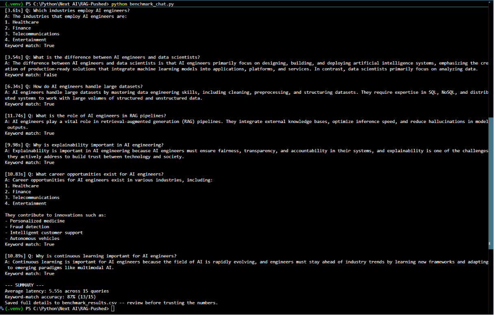

# Document Query Engine

A FastAPI-based Retrieval-Augmented Generation (RAG) assistant with a web chat UI, in-browser voice chat, and a standalone terminal voice agent. Responses are grounded strictly in a defined knowledge base — the model will not answer questions outside the provided content, by design, to prevent hallucination.

**Watch the demo:** [youtu.be/QCVw8kZ5SOw](https://youtu.be/QCVw8kZ5SOw)

## Features

- **Web chat UI** — ask questions through a browser interface
- **Voice chat (browser)** — speech-to-text (Groq Whisper) and text-to-speech (Groq Orpheus) for spoken Q&A
- **Terminal voice agent** — a separate CLI client for voice interaction using your local microphone and speakers
- **Knowledge-grounded responses** — answers are constrained to the provided knowledge base (`sample.txt`); out-of-scope questions are explicitly declined rather than hallucinated

## Architecture

| Component   | Technology              |
|-------------|--------------------------|
| LLM         | Groq API                 |
| Embeddings  | Gemini API                |
| Backend     | FastAPI                   |
| Speech-to-Text | Groq Whisper           |
| Text-to-Speech | Groq Orpheus           |

## Prerequisites

- Docker Desktop
- Python 3.11 or newer (required for running `voice-agent.py` locally)
- A Groq API key
- A Google API key

## Environment Setup

Create a `.env` file from the example file:

```powershell
Copy-Item .env.example .env
```

Edit `.env` and add your keys:

```env
GROQ_API_KEY="your_groq_api_key"
GOOGLE_API_KEY="your_google_api_key"
```

## Running the App

### Option 1 — Locally with Uvicorn

In one terminal, start the server:

```powershell
uvicorn main:app --reload
```

Then open in your browser:

```text
http://127.0.0.1:8000
```

The interface looks like this:



Ask a question — the model responds using only the content available in `sample.txt`:



If a question falls outside the content of `sample.txt`, the model declines to answer rather than guessing:



### Option 2 — With Docker

Build and start the FastAPI app:

```powershell
docker compose up --build
```

Open the app in your browser:

```text
http://localhost:8012
```

Stop the app:

```powershell
docker compose down
```

Run the optional terminal chat client inside Docker:

```powershell
docker compose --profile cli run --rm cli
```

### Option 3 — Terminal Voice Agent

The terminal voice agent uses your local microphone and speakers, so run it on your host machine rather than inside Docker.

Create and activate a virtual environment:

```powershell
py -3.11 -m venv .venv
.\.venv\Scripts\Activate.ps1
```

Install dependencies:

```powershell
python -m pip install --upgrade pip
pip install -r requirements.txt
```

Start the voice agent:

```powershell
python .\voice-agent.py
```

Press **Enter** to record a question. Type `exit` and press **Enter** to quit.

## Benchmarking — Latency & Accuracy

`benchmark_chat.py` runs a predefined set of test questions against the `/chat` endpoint, measuring response latency and grading each answer against an expected keyword.

With the app running in one terminal, run the benchmark in a second terminal:

```powershell
python benchmark_chat.py
```

Sample output:



**Results — 15-query manually-graded test set:**

| Metric                  | Value   |
|--------------------------|---------|
| Average response latency | 5.55s   |
| Keyword-match accuracy    | 87%     |

Full per-query results (question, answer, latency, correctness) are written to `benchmark_results.csv` after each run.

## License

Copyright (c) 2026 Anup Rai. All rights reserved. This repository is available for personal, non-commercial reference only.
